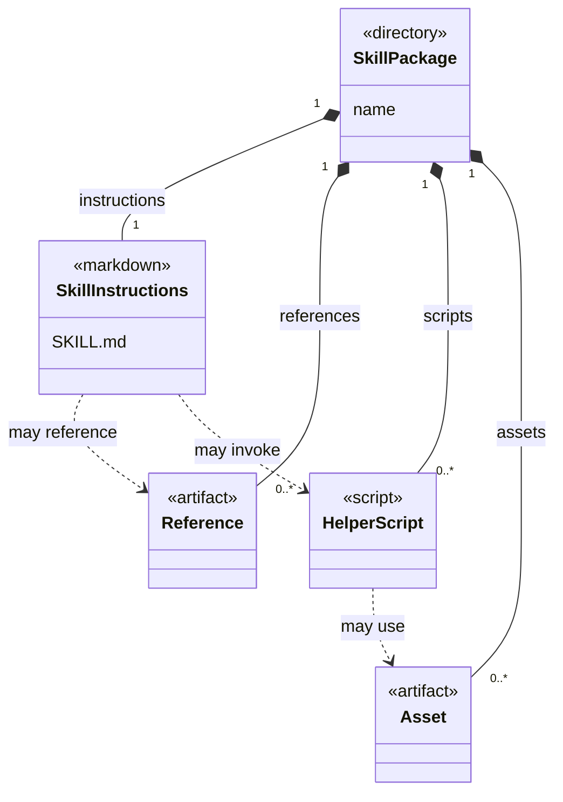

# Codex Skills Catalog — Fork

A fork of OpenAI's skills catalog containing task instructions, references, assets, and helper scripts for Codex workflows.

**Technology:** Markdown skills · Reference material · Task-specific scripts

**Upstream:** [openai/skills](https://github.com/openai/skills). This repository is a fork; original authorship remains with the upstream project and its contributors.

## Features

- Organize task skills under the committed catalog directories.
- Provide each skill's `SKILL.md` instructions alongside references and optional scripts/assets.
- Include workflows spanning development, design, documents, research, and other tasks.

## Repository guide

| Path | Purpose |
|---|---|
| [skills/.curated](skills/.curated) | Curated task skill folders. |
| [contributing.md](contributing.md) | Community contribution guidance. |

## Requirements and current limitations

This repository is a fork of `openai/skills`. Individual skill directories can include separate `LICENSE.txt` files and their own runtime requirements; inspect those files before reuse. This README does not claim authorship of the upstream catalog or that every listed integration is configured in your environment.

## UML diagrams

### Skill packaging model

This UML packaging model describes artifacts inside a skill directory. Its nodes are file roles, not runtime classes; references, scripts, and assets are optional.



## Getting started

```bash
git clone https://github.com/IbrahimAbdelsattar/skills.git
cd skills
```

Browse `skills/.curated/` and open the `SKILL.md` for a task you want to understand. Read its prerequisites, referenced files, and commands before using its helper scripts. Follow the installation workflow supported by your Codex environment; copying a README alone does not install a skill.
